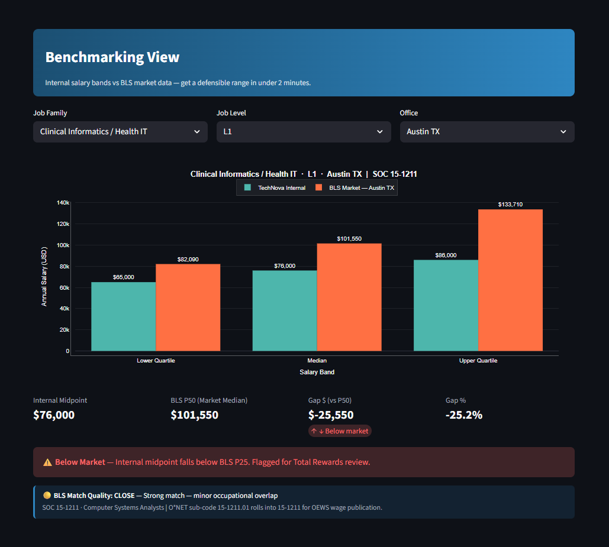
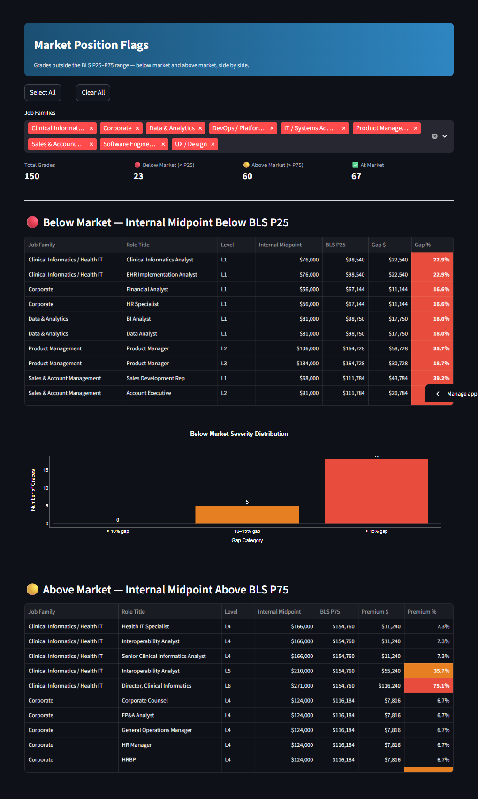
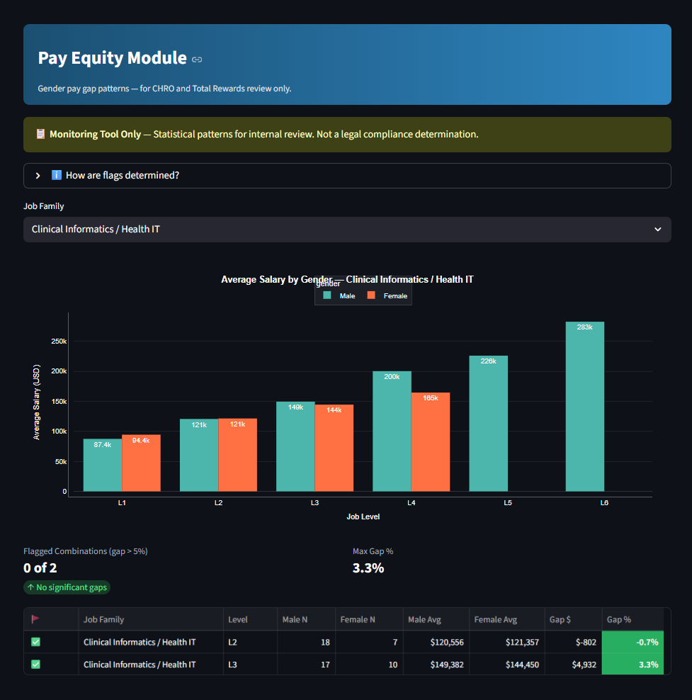
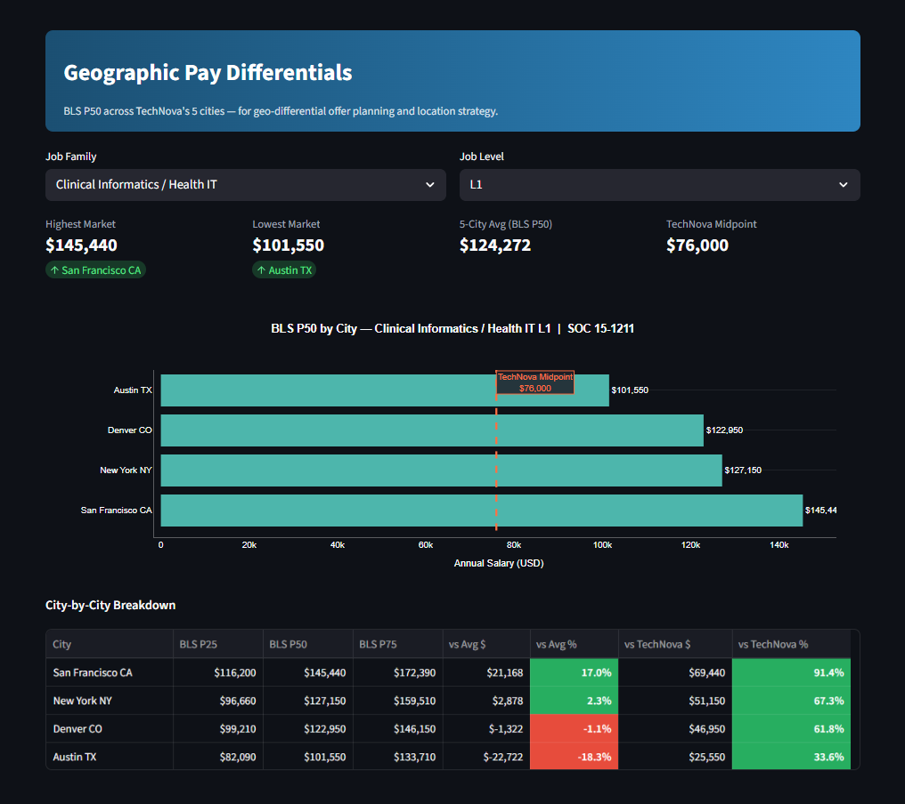
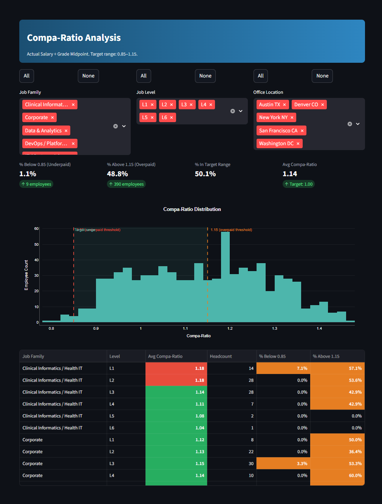
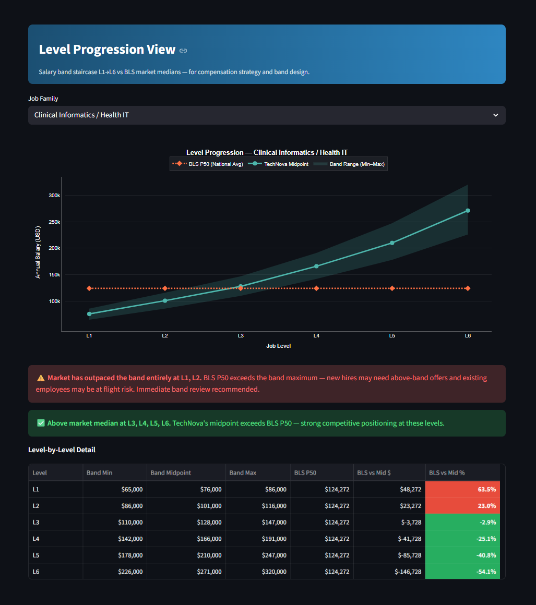

# TechNova Compensation & Market Benchmarking Dashboard

**Portfolio Project S2 | Hadi Mercer | BA Portfolio 2026**

A full-stack data pipeline and interactive dashboard that pulls real wage data from the Bureau of Labor Statistics, stores it alongside internal job grade data in PostgreSQL, and surfaces compensation benchmarking gaps, pay equity flags, and workforce analytics through a live 8-page Streamlit web application.

> TechNova is a realistic fictional healthcare technology company created for portfolio demonstration. All employee data, salary figures, and organizational details are synthetic.

---

## Live Demo

🔗 **Dashboard:** [comp-benchmarking-hadimercer-ps2.streamlit.app](https://comp-benchmarking-hadimercer-ps2.streamlit.app/)  
📁 **Portfolio Hub:** [hadimercer.github.io](https://hadimercer.github.io)

---

## Screenshots

### Benchmarking View — Internal vs BLS Market Range


### Market Position Flags — Below & Above Market


### Pay Equity Module — Gender Gap Analysis


### Salary Distribution — Box Plots by Level


### Geographic Pay Differentials — 5-City Comparison


### Compa-Ratio Distribution


### Level Progression — Band Staircase vs BLS Median


---

## What This Project Demonstrates

| Capability | Evidence |
|---|---|
| Business Analysis | BABOK v3-aligned FRD, stakeholder map, MoSCoW prioritization, traceability matrix |
| Data Engineering | Python pipeline: API ingestion, CSV validation, PostgreSQL loading, audit logging |
| API Integration | BLS OEWS REST API — 600 series/run, batched requests, registered key, error handling |
| Database Design | PostgreSQL schema: 8 tables, FK constraints, indexes, unique constraints |
| Data Modeling | Job-to-SOC crosswalk with match quality metadata across 38 role mappings |
| Visualization | 8-page Streamlit dashboard: benchmarking, flags, equity, distributions, geo differentials |
| HR Analytics | Compa-ratio analysis, level progression modeling, geographic pay differentials |
| Documentation | OpenAPI/Swagger spec (FR-17), UML sequence diagram (FR-18), data dictionary |
| Security | Environment variable credential management, no hardcoded secrets (NFR-02c) |

---

## Project Architecture

```
BLS Public API (OEWS)
        │
        ▼
pipeline/bls_pipeline.py
  ├── Reads SOC codes from job_soc_crosswalk
  ├── Reads MSA codes from employees table
  ├── Builds series IDs (5 MSAs × 20 SOC codes × 6 data types)
  ├── Batches API calls (50/request, registered key)
  ├── Validates + transforms response
  └── Upserts → bls_wage_data + pipeline_run_log

data/ CSVs (employees + job grades)
        │
        ▼
pipeline/csv_ingestion.py
  ├── Schema validation (rejects entire file on failure — NFR-01a)
  └── Upserts → employees + internal_job_grades + pipeline_run_log

pipeline/seed_reference_data.py
  └── Seeds → soc_code_reference + job_soc_crosswalk
        │
        ▼
PostgreSQL (Supabase)
  ├── employees             (800 rows — synthetic)
  ├── internal_job_grades   (150 rows — salary bands)
  ├── bls_wage_data         (market wage data by SOC + MSA + year)
  ├── soc_code_reference    (20 SOC codes)
  ├── job_soc_crosswalk     (38 role mappings with match quality)
  ├── pipeline_run_log      (audit trail — every run logged)
  ├── crosswalk_change_log  (controlled artifact history — NFR-01c)
  └── job_families          (lookup)
        │
        ▼
Streamlit Dashboard (app.py) — 8 pages
  ├── Page 1: Benchmarking View
  ├── Page 2: Market Position Flags
  ├── Page 3: Pay Equity Module
  ├── Page 4: Salary Distribution
  ├── Page 5: Geographic Pay Differentials
  ├── Page 6: Compa-Ratio Analysis
  ├── Page 7: Level Progression View
  └── Page 8: Data Management
```

---

## Repository Structure

```
comp-benchmarking/
├── data/
│   ├── technova_employees.csv            # 800 synthetic employees
│   └── technova_job_grades.csv           # 150 job grade band definitions
├── docs/
│   ├── TechNova_FRD_COMP001.docx         # BABOK-aligned FRD (FR-01 to FR-18)
│   ├── TechNova_SOC_Crosswalk_XWALK001.xlsx  # SOC mapping artifact
│   ├── bls_oews_api.yaml                 # OpenAPI 3.0 Swagger spec (FR-17)
│   ├── sequence_diagram.md               # UML sequence diagram — Mermaid (FR-18)
│   └── screenshots/                      # Dashboard screenshots for README
├── logs/                                 # Pipeline run logs (git-ignored)
├── pipeline/
│   ├── __init__.py
│   ├── csv_ingestion.py                  # CSV → PostgreSQL loader + validator
│   ├── seed_reference_data.py            # SOC codes + crosswalk seeder
│   └── bls_pipeline.py                   # BLS API → PostgreSQL pipeline
├── .streamlit/
│   └── config.toml                       # Dark theme + TechNova brand color
├── app.py                                # Streamlit dashboard — 8 pages
├── requirements.txt                      # Python dependencies
├── .env                                  # Credentials (git-ignored)
├── .gitignore
└── README.md                             # This file
```

---

## Dashboard Pages

### Page 1 — Benchmarking View
Filter by job family, level, and city to see TechNova's internal salary range (min/mid/max) alongside the BLS market range (P25/P50/P75) in a side-by-side grouped bar chart. Color-coded KPIs show gap $ and gap % vs market median. Match quality indicator shows SOC mapping confidence. Target: defensible market range in under 2 minutes (OBJ-01).

### Page 2 — Market Position Flags
All job grade combinations where TechNova's internal midpoint falls below the BLS P25 (below market) or above the BLS P75 (above market). Severity distribution chart shows gap concentration. Select All / Clear All filters for efficient family-level review.

### Page 3 — Pay Equity Module
Gender pay gap analysis by job family and level. Groups with fewer than 5 employees per gender are excluded. Gaps exceeding 5% are flagged for Total Rewards review. Framed as a monitoring tool — not a legal compliance determination (CON-06). Restricted audience: CHRO and Total Rewards.

### Page 4 — Salary Distribution
Box plots of actual employee salary distributions per job family, with BLS P25/P50/P75 benchmark lines overlaid. Supports gender split view. Summary statistics table by level. Shows spread, outliers, and where the workforce sits relative to market.

### Page 5 — Geographic Pay Differentials
Horizontal bar chart comparing BLS P50 for the same role across all 5 TechNova cities, with TechNova's internal midpoint as a reference line. City-by-city table shows vs 5-city average and vs TechNova midpoint in $ and %. Critical for geo-differential offer decisions.

### Page 6 — Compa-Ratio Analysis
Per-employee compa-ratio (actual salary ÷ grade midpoint) across all job families and levels. Histogram with target range shaded (0.85–1.15). Summary table with % below 0.85 and % above 1.15 by family/level. Industry-standard metric every compensation professional recognizes immediately.

### Page 7 — Level Progression View
Salary band staircase from L1 to L6 for any selected job family. Shaded band range (min–max) with midpoint line, overlaid with BLS P50 market median at each level. Commentary auto-generates: levels where market has outpaced the band are flagged for immediate review.

### Page 8 — Data Management
- Download CSV templates for employee and job grade data
- Upload CSV → schema validation → confirm → load to database
- Trigger BLS pipeline refresh from the browser (FR-02)
- Pipeline run history — last 10 runs with status, record counts, timestamps
- Data freshness indicator in sidebar — last BLS refresh + last CSV upload

---

## Setup Instructions

### Prerequisites
- Python 3.9+
- A free [Supabase](https://supabase.com) account
- A free [BLS API registration key](https://data.bls.gov/registrationEngine)

### 1. Clone the repository
```bash
git clone https://github.com/hadimercer/comp-benchmarking.git
cd comp-benchmarking
```

### 2. Install dependencies
```bash
pip install -r requirements.txt
```

### 3. Set up the database
Create a new Supabase project, open the SQL Editor, paste and run the schema SQL.

### 4. Configure environment variables
Create a `.env` file in the project root:
```
DB_HOST=your-supabase-host
DB_PORT=5432
DB_NAME=postgres
DB_USER=postgres
DB_PASSWORD=your-supabase-password
BLS_REGISTRATION_KEY=your-bls-key
BLS_SURVEY_YEAR=2024
DATA_DIR=./data
LOG_DIR=./logs
```

### 5. Run the pipelines in order
```bash
python -m pipeline.csv_ingestion
python -m pipeline.seed_reference_data
python -m pipeline.bls_pipeline
```

### 6. Launch the dashboard
```bash
python -m streamlit run app.py
```

---

## Portfolio Artifacts

| Artifact | File | Traces To |
|---|---|---|
| Functional Requirements Document | `docs/TechNova_FRD_COMP001.docx` | All FRs |
| SOC Code Crosswalk | `docs/TechNova_SOC_Crosswalk_XWALK001.xlsx` | FR-08 |
| OpenAPI / Swagger Spec | `docs/bls_oews_api.yaml` | FR-17 |
| UML Sequence Diagram | `docs/sequence_diagram.md` | FR-18 |
| Live Dashboard | [streamlit.app link](https://comp-benchmarking-hadimercer-ps2.streamlit.app/) | FR-11 to FR-16 |

---

## BLS OEWS Series ID Format

The BLS OEWS API uses a 25-character series identifier:

```
O E U M {area_code} {industry} {occupation} {data_type}
│       │ │          │          │             └─ 001=mean, 204=P25, 206=P50, 208=P75
│       │ │          │          └─────────────── SOC code (no hyphen, 5 digits)
│       │ │          └────────────────────────── 000000 = all industries
│       │ └───────────────────────────────────── MSA code (7 digits, zero-padded)
│       └───────────────────────────────────────  M = MSA-level geography
└─────────────────────────────────────────────── OEU = OEWS survey prefix
```

> **Critical:** Position 4 must be `M` for MSA-level data.

---

## The 5 TechNova MSAs

| City | MSA Code |
|---|---|
| Austin TX | 12420 |
| New York NY | 35620 |
| San Francisco CA | 41860 |
| Washington DC | 47900 |
| Denver CO | 19740 |

---

## Functional Requirements Coverage

| ID | Requirement | Status |
|---|---|---|
| FR-01 | BLS API pull — wage percentiles + MSA filter | ✅ |
| FR-02 | Quarterly manual trigger | ✅ |
| FR-03 | Pipeline run log | ✅ |
| FR-04 | Error detection | ✅ |
| FR-05 | CSV load to PostgreSQL | ✅ |
| FR-06 | Schema validation before write | ✅ |
| FR-07 | CSV template | ✅ |
| FR-08 | Job-to-SOC crosswalk | ✅ |
| FR-09 | MSA-level geographic wage storage | ✅ |
| FR-10 | Data dictionary | ✅ |
| FR-11 | Filter: family + level + location → range | ✅ |
| FR-12 | Internal vs market side-by-side view | ✅ |
| FR-13 | Percentile toggle (P25 / P50 / P75) | ✅ |
| FR-14 | Below-market flags view | ✅ |
| FR-15 | Pay equity gap flags view | ✅ |
| FR-16 | Data freshness indicator | ✅ |
| FR-17 | OpenAPI/Swagger spec for BLS integration | ✅ |
| FR-18 | UML sequence diagram — end-to-end data flow | ✅ |

---

## Portfolio Context

This is **Smaller Project 2 (S2)** of a 6-project BA portfolio:

| # | Project | Focus |
|---|---|---|
| F1 | Operational Process Intelligence | What-if simulation |
| F2 | BA Co-Pilot | AI-powered artifact generation |
| S1 | HR Process Automation Hub | Workflow automation |
| **S2** | **Comp & Benchmarking Dashboard** | **← This project** |
| S3 | Program Portfolio Dashboard | RAG status health view |
| S4 | Sentiment & Text Analytics | NLP analysis |

---

## Contact

**Hadi Mercer**  
LinkedIn: [linkedin.com/in/hadimercer](https://linkedin.com/in/hadimercer)  
GitHub: [github.com/hadimercer](https://github.com/hadimercer)
