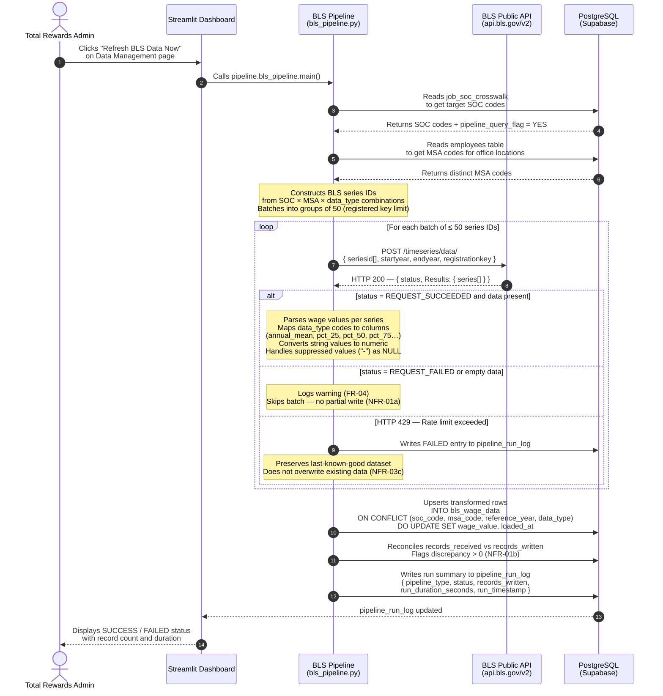
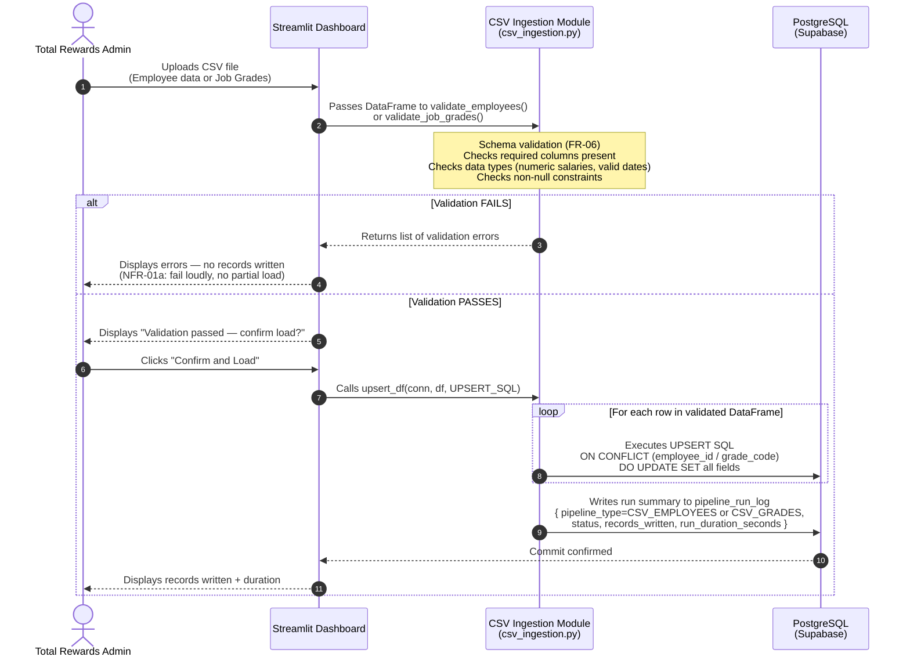
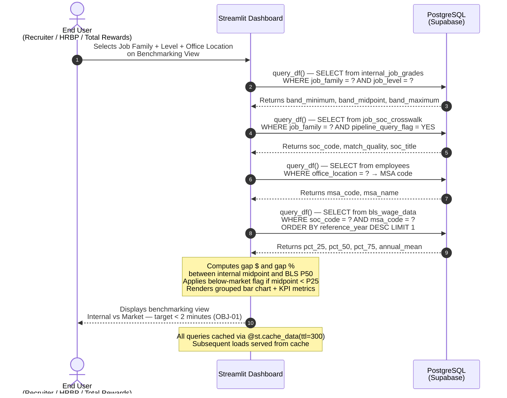

# UML Sequence Diagram — End-to-End Data Flow

**Document ID:** FRD-COMP-001 | FR-18  
**Project:** TechNova Compensation & Market Benchmarking Dashboard  
**Prepared by:** Business Analyst — BA Portfolio Project 2  
**Date:** February 2026  
**Traces to:** OBJ-02, OBJ-05

---

## Overview

This diagram illustrates the complete end-to-end data flow of TechNova's
Compensation & Market Benchmarking Dashboard — from a Total Rewards
administrator triggering a pipeline refresh, through BLS API data acquisition,
PostgreSQL storage, and final data consumption by the Streamlit dashboard.

Two distinct flows are shown:
- **Flow A — BLS Pipeline:** External market data ingestion (quarterly)
- **Flow B — CSV Ingestion:** Internal employee and job grade data upload
- **Flow C — Dashboard Query:** Read path from dashboard to database

---

## Participants

| Participant | Type | Description |
|---|---|---|
| Total Rewards Admin | Human Actor | Initiates pipeline runs and CSV uploads |
| Streamlit Dashboard | Frontend | 8-page compensation intelligence UI |
| BLS Pipeline | Python Module | `pipeline/bls_pipeline.py` — API client + transformer + loader |
| CSV Ingestion Module | Python Module | `pipeline/csv_ingestion.py` — validator + loader |
| BLS Public API | External System | `https://api.bls.gov/publicAPI/v2` |
| PostgreSQL (Supabase) | Database | Single source of truth — all market + internal data |
| End User (Recruiter / HRBP) | Human Actor | Consumes dashboard for offer decisions |

---

## Flow A — BLS Market Data Pipeline

---

## Flow B — CSV Internal Data Ingestion

---

## Flow C — Dashboard Query (Read Path)

---

## Error Handling Summary

| Scenario | Pipeline Behaviour | Traces To |
|---|---|---|
| BLS API returns `REQUEST_FAILED` | Log warning, skip batch, no write | FR-04 |
| HTTP 429 — rate limit | Log FAILED, preserve existing data | NFR-03c |
| HTTP 500 — server error | Log FAILED, preserve existing data | NFR-03c |
| CSV schema validation fails | Return errors to UI, zero records written | NFR-01a, FR-06 |
| Records received ≠ records written | Flag discrepancy in run log | NFR-01b |
| DB connection failure | Exception raised, logged, UI shows error | NFR-03a |

---

## Data Store Reference

| Table | Written By | Read By | Purpose |
|---|---|---|---|
| `bls_wage_data` | BLS Pipeline | Dashboard, BLS Pipeline | BLS market wage data by SOC + MSA + year |
| `internal_job_grades` | CSV Ingestion | Dashboard | TechNova salary bands by job family + level |
| `employees` | CSV Ingestion | Dashboard, BLS Pipeline | Employee records with office location + salary |
| `job_soc_crosswalk` | Manual / Admin | BLS Pipeline, Dashboard | SOC code mapping — controlled artifact (NFR-01c) |
| `pipeline_run_log` | BLS Pipeline, CSV Ingestion | Dashboard (sidebar freshness) | Audit log of all pipeline runs |
